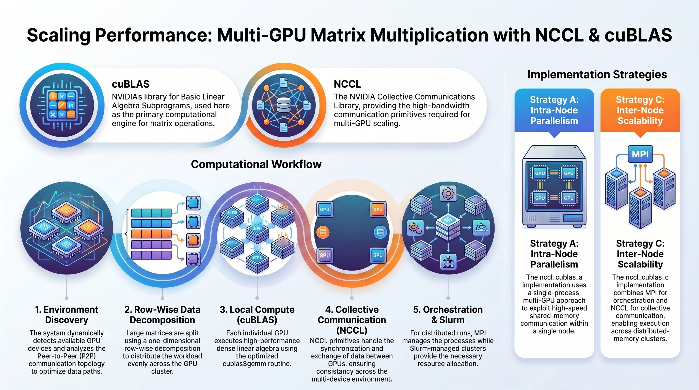

# NCCL cuBLAS Multi-GPU 

The goal of this repository is to explore efficient multi-GPU matrix multiplication by combining cuBLAS for high-performance compute with NCCL for optimized GPU communication.

## Test 1 : NCCL + cuBLAS Multi-GPU Matrix Multiplication

This project investigates two strategies for accelerating dense matrix multiplication on NVIDIA GPU architectures, targeting both shared-memory multi-GPU systems and distributed-memory environments.

**Two implementations are provided:**
* nccl_cublas_a: a single-process, multi-GPU approach exploiting intra-node parallelism
* nccl_cublas_c: a distributed implementation combining MPI and NCCL for inter-node scalability

The computational kernel relies on cuBLAS, specifically the cublasSgemm routine, to achieve high-performance dense linear algebra. Inter-GPU communication is handled NCCL, which provides optimized collective communication primitives designed for multi-GPU and multi-node systems.

**Architecture**
* Dynamic detection of available GPU devices
* Extraction and analysis of peer-to-peer (P2P) communication topology
* One-dimensional row-wise data decomposition
* Local matrix multiplication using cuBLAS
* Collective communication using NCCL primitives
* MPI-based orchestration for distributed execution on Slurm-managed clusters

This approach reflects common design patterns in scalable HPC and AI workloads.

### Detail information

* [Matrix Multiplication with NCCL](docs/InformationLevel1.md)

## Test 2 : NCCL + cuBLAS Multi-GPU Matrix Cholesky

...

## Test 3 : NCCL + cuBLAS Multi-GPU ...

---

## 📝 **Author**

**Dr. Patrick Lemoine**  
*Engineer Expert in Scientific Computing*  
[LinkedIn](https://www.linkedin.com/in/patrick-lemoine-7ba11b72/)

---
