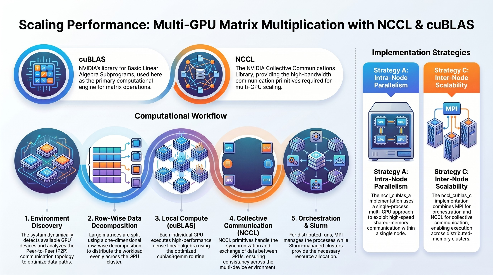
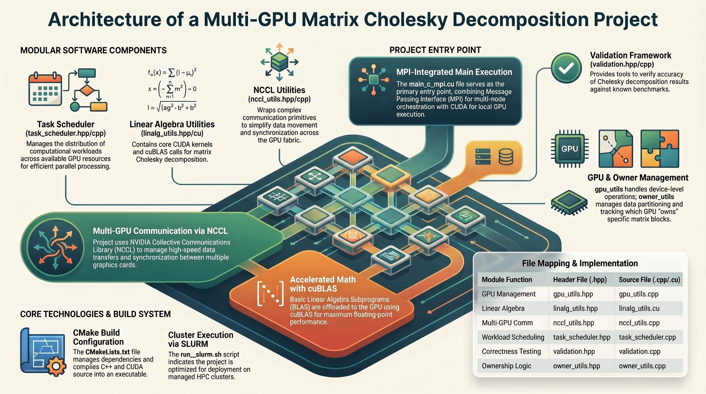
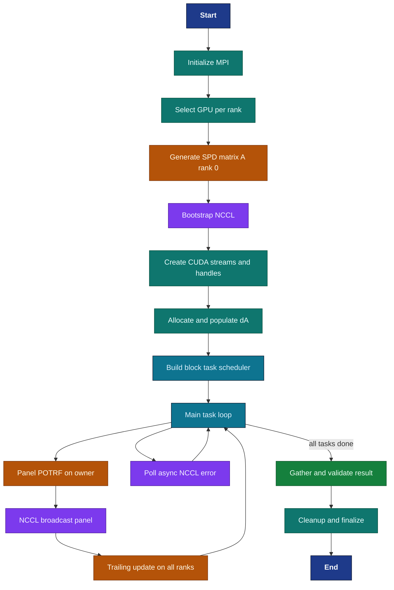
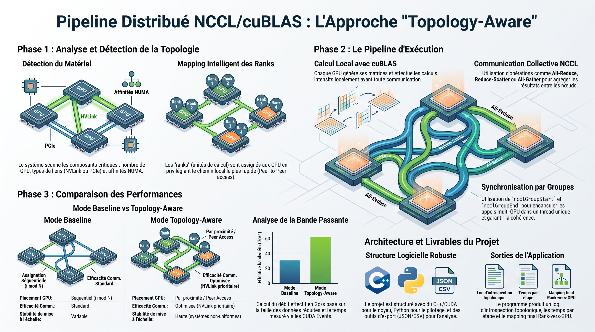
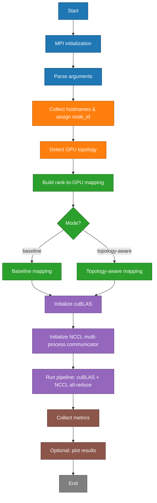

# NCCL cuBLAS Multi-GPU 

The goal of this repository is to explore efficient multi-GPU matrix multiplication by combining cuBLAS for high-performance compute with NCCL for optimized GPU communication.

## Test 1 : NCCL + cuBLAS Multi-GPU Matrix Multiplication

This project investigates two strategies for accelerating dense matrix multiplication on NVIDIA GPU architectures, targeting both shared-memory multi-GPU systems and distributed-memory environments.

**Two implementations are provided:**
* nccl_cublas_a: a single-process, multi-GPU approach exploiting intra-node parallelism
* nccl_cublas_c: a distributed implementation combining MPI and NCCL for inter-node scalability

The computational kernel relies on cuBLAS, specifically the cublasSgemm routine, to achieve high-performance dense linear algebra. Inter-GPU communication is handled NCCL, which provides optimized collective communication primitives designed for multi-GPU and multi-node systems.

**Architecture**
* Dynamic detection of available GPU devices
* Extraction and analysis of peer-to-peer (P2P) communication topology
* One-dimensional row-wise data decomposition
* Local matrix multiplication using cuBLAS
* Collective communication using NCCL primitives
* MPI-based orchestration for distributed execution on Slurm-managed clusters

This approach reflects common design patterns in scalable HPC and AI workloads.

### Detail information

* [Matrix Multiplication with NCCL](docs/InformationLevel1.md)

## Test 2 : NCCL + cuBLAS Multi-GPU Cholesky Matrix Decompositions

This project implements a distributed, multi-GPU Cholesky factorization using MPI, NCCL, cuSOLVER, and cuBLAS. It decomposes a symmetric positive definite matrix \(A\) into \(LL^T\) across multiple nodes and GPUs, using cuSOLVER for panel factorizations and cuBLAS for trailing matrix updates. The architecture assigns panels to “owner” MPI ranks in a blocked layout, broadcasts each factored panel via stream-aware NCCL collectives, and drives local updates through a task scheduler that overlaps communication and computation without global MPI barriers.

**Architecture**

* Dynamic detection of available GPU devices and binding of MPI ranks to GPUs
* Blocked, right-looking Cholesky factorization with panel ownership per MPI rank
* Stream-aware NCCL collectives to broadcast factored panels across GPUs and nodes
* Local panel factorization using cuSOLVER and trailing updates (TRSM + GEMM) using cuBLAS
* Task-based scheduler that drives panel, broadcast, and update steps without global MPI barriers, enabling overlap of communication and computation
* MPI-based bootstrap and coordination, designed to run efficiently on Slurm-managed multi-node clusters

```mermaid
flowchart TD

  %% Nodes
  S[Start]

  MPI_INIT[Initialize MPI]
  GPU_SELECT[Select GPU per rank]
  GEN_A[Generate SPD matrix A rank 0]

  NCCL_BOOT[Bootstrap NCCL]
  STREAMS[Create CUDA streams and handles]
  ALLOC_A[Allocate and populate dA]

  SCHED[Build block task scheduler]
  LOOP[Main task loop]

  POTRF[Panel POTRF on owner]
  BCAST[NCCL broadcast panel]
  UPDATE[Trailing update on all ranks]

  ASYNC_ERR[Poll async NCCL error]

  VALIDATE[Gather and validate result]
  CLEANUP[Cleanup and finalize]
  E[End]

  %% Edges
  S --> MPI_INIT --> GPU_SELECT --> GEN_A --> NCCL_BOOT --> STREAMS --> ALLOC_A --> SCHED --> LOOP

  LOOP --> POTRF --> BCAST --> UPDATE --> LOOP
  LOOP --> ASYNC_ERR --> LOOP

  LOOP -->|all tasks done| VALIDATE --> CLEANUP --> E

  %% Styles
  classDef startEnd fill:#1e3a8a,stroke:#0f172a,color:#f9fafb,font-weight:bold;
  classDef init fill:#0f766e,stroke:#064e3b,color:#ecfeff;
  classDef comm fill:#7c3aed,stroke:#4c1d95,color:#f5f3ff;
  classDef compute fill:#b45309,stroke:#78350f,color:#fffbeb;
  classDef sched fill:#0e7490,stroke:#0f172a,color:#e0f2fe;
  classDef validate fill:#15803d,stroke:#14532d,color:#ecfdf3;
  classDef error fill:#b91c1c,stroke:#7f1d1d,color:#fee2e2;

  class S,E startEnd;
  class MPI_INIT,GPU_SELECT,STREAMS,ALLOC_A init;
  class GEN_A,POTRF,UPDATE compute;
  class NCCL_BOOT,BCAST,ASYNC_ERR comm;
  class SCHED,LOOP sched;
  class VALIDATE validate;
  class CLEANUP init;
```

...

## Test 3 : Topology-aware NCCL Distributed Pipeline (TNDP)

This project, Topology-aware NCCL Distributed Pipeline (TNDP), is a multi-GPU and multi-node demonstration of how to exploit hardware topology when using NVIDIA’s NCCL collective communication library together with cuBLAS. The goal is to show that a simple distributed pipeline can be made aware of the underlying NVLink/PCIe and NUMA topology, and that this awareness can measurably improve communication performance at scale.

The pipeline runs a basic compute stage with cuBLAS on each GPU, followed by NCCL collectives (e.g. all-reduce) across multiple GPUs and nodes. It supports two execution modes:

* Baseline: a simple round-robin mapping of MPI ranks to GPUs, without considering topology.

* Topology-aware: a rank placement strategy that:

* detects GPU peer access and NVLink/PCIe connectivity using CUDA APIs,

* groups GPUs into “islands” of high-performance links,

* assigns ranks preferentially within these islands,

* and optionally uses node and NUMA affinity information when running on multi-node systems.

This demo is designed to be useful both as a learning example and as a small but realistic benchmark for multi-GPU NCCL usage in HPC and AI workloads.

```mermaid
flowchart TD
    %% Nodes
    S[Start]
    MPI[MPI initialization]
    PAR[Parse arguments]
    HOST[Collect hostnames & assign node_id]
    TOPO[Detect GPU topology]
    MAP[Build rank-to-GPU mapping]
    MODE{Mode?}
    BAS[Baseline mapping]
    TOPOA[Topology-aware mapping]
    CUBLAS[Initialize cuBLAS]
    NCCL[Initialize NCCL multi-process communicator]
    RUN[Run pipeline: cuBLAS + NCCL all-reduce]
    MET[Collect metrics]
    PLOT[Optional: plot results]
    END[End]

    %% Flow
    S --> MPI
    MPI --> PAR
    PAR --> HOST
    HOST --> TOPO
    TOPO --> MAP
    MAP --> MODE
    MODE -->|baseline| BAS
    MODE -->|topology-aware| TOPOA
    BAS --> CUBLAS
    TOPOA --> CUBLAS
    CUBLAS --> NCCL
    NCCL --> RUN
    RUN --> MET
    MET --> PLOT
    PLOT --> END

    %% Classes
    classDef initNode fill:#1f77b4,stroke:#0b3c68,stroke-width:1px,color:#ffffff;
    classDef topoNode fill:#ff7f0e,stroke:#b25906,stroke-width:1px,color:#ffffff;
    classDef mapNode fill:#2ca02c,stroke:#166016,stroke-width:1px,color:#ffffff;
    classDef computeNode fill:#9467bd,stroke:#5d3b7d,stroke-width:1px,color:#ffffff;
    classDef metricsNode fill:#8c564b,stroke:#5a352f,stroke-width:1px,color:#ffffff;
    classDef finishNode fill:#7f7f7f,stroke:#4c4c4c,stroke-width:1px,color:#ffffff;

    %% Apply classes
    class S initNode;
    class MPI,PAR initNode;
    class HOST,TOPO topoNode;
    class MAP,MODE,BAS,TOPOA mapNode;
    class CUBLAS,NCCL,RUN computeNode;
    class MET,PLOT metricsNode;
    class END finishNode;
```

---

## Test 4 : NCCL + cuBLAS Multi-GPU ...

---

## 📝 **Author**

**Dr. Patrick Lemoine**  
*Engineer Expert in Scientific Computing*  
[LinkedIn](https://www.linkedin.com/in/patrick-lemoine-7ba11b72/)

---
