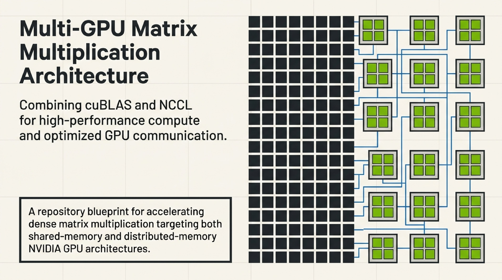
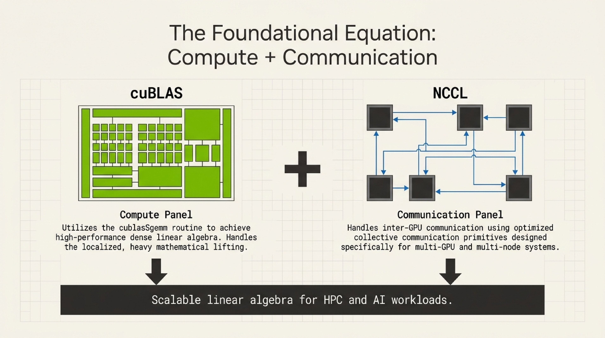
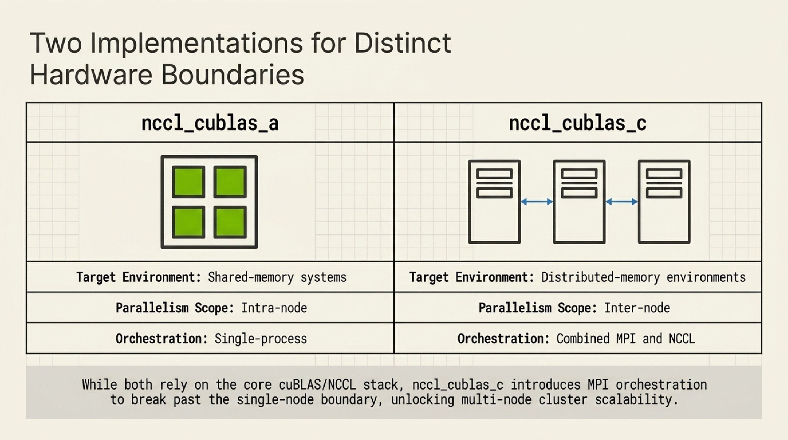
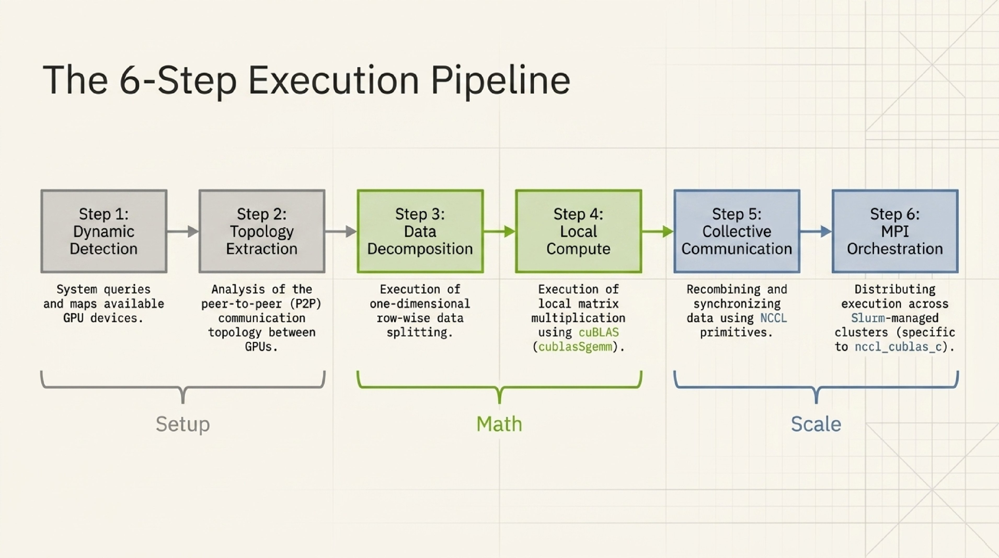
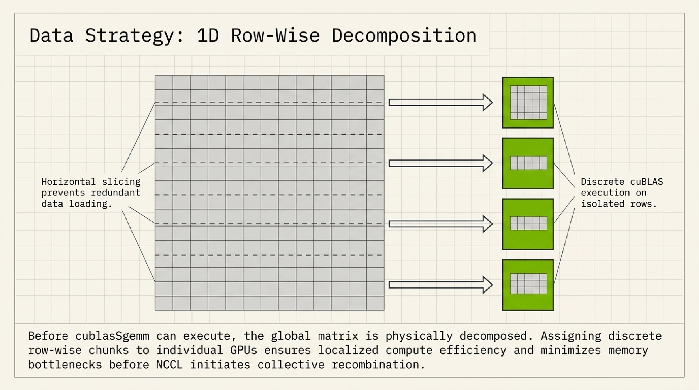
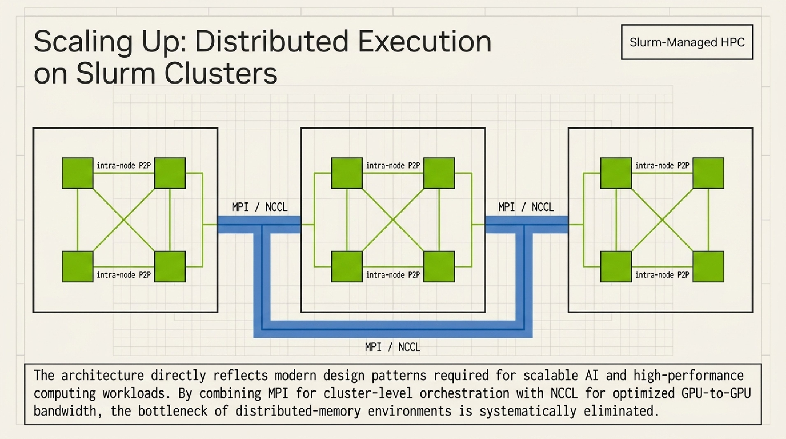

# NCCL cuBLAS Multi-GPU Matrix Multiplication

---

## 📝 **Author**

**Dr. Patrick Lemoine**  
*Engineer Expert in Scientific Computing*  
[LinkedIn](https://www.linkedin.com/in/patrick-lemoine-7ba11b72/)

---
